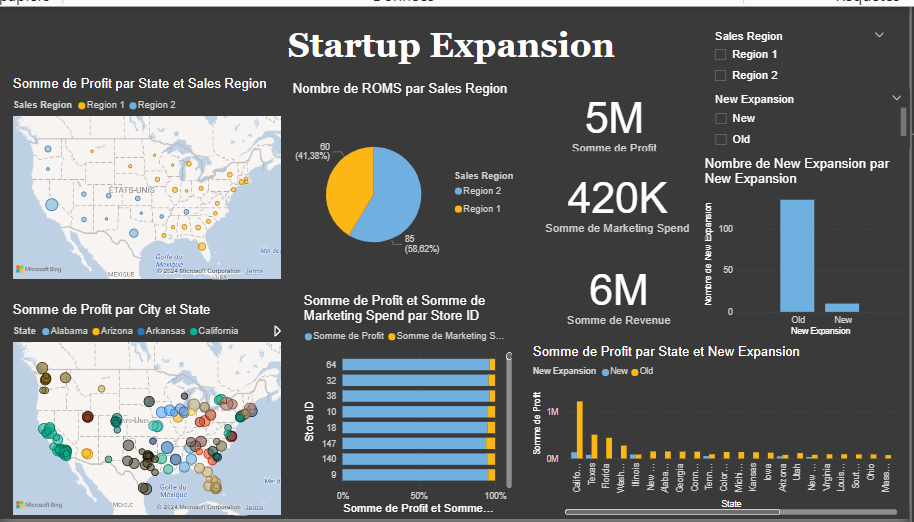

# Startup Expansion Dashboard

## Project Overview

The "Startup Expansion" project is designed to analyze and visualize the expansion strategy of a startup across various states in the U.S. This project uses data from multiple sources, including sales regions, profit margins, and marketing spend, to provide insights into the effectiveness of the expansion efforts.

The analysis is implemented using Power BI, Python (in Jupyter Notebook), and various data processing techniques.

## Features

- **Sales and Profit Analysis**: Breakdown of sales and profits by state, city, and sales region.
- **Marketing Spend**: Insights into the marketing budget allocated across different store IDs and regions.
- **Revenue and Profit Comparison**: Visualization of revenue and profit across new and existing expansions.
- **Interactive Dashboards**: Use of Power BI for creating dynamic and interactive visualizations.

## Data Sources

The project utilizes data from the following sources:

- **Startup Expansion Data**: Detailed records of sales, profits, marketing spend, and expansion status for various regions and stores.
- **External Datasets**: Data from public sources to complement the analysis and provide context.

The data is stored in `startup-expansion.xlsx` and `new-startup-expansion.csv`.

## Usage

### Jupyter Notebook

- Open the `Startup-expanation.ipynb` notebook using Jupyter Notebook.
- Run the cells to execute the analysis and visualize the data.

### Power BI

- Open the `Project 1.pbix` file in Power BI Desktop.
- Interact with the visualizations to explore the data and gain insights.

## Visualizations

The project includes several key visualizations, such as:

- **Profit by State and Sales Region**: A map-based visualization showing profit distribution across states.
- **Marketing Spend by Store ID**: A bar chart comparing marketing expenditure across different store IDs.
- **New Expansion Analysis**: A bar chart that compares the number of new expansions against old expansions by state.

These visualizations are crucial for understanding the startup’s performance and guiding strategic decisions.

## Contributing

Contributions are welcome! Please fork the repository and create a pull request with your changes.

## Contact

For any questions or inquiries, please contact:

- **Name**: Nourhane Bendjeddou
- **Email**: nourhane@gmail.com
- **LinkedIn**: [Nourhane Bendjeddou](https://www.linkedin.com/in/nourhane-bendjeddou-a4252625b/)
